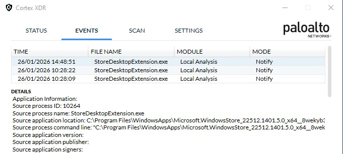
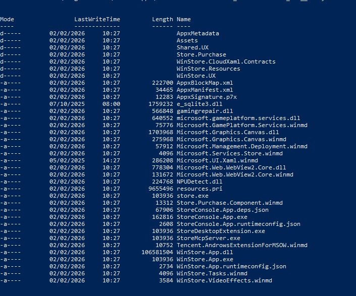
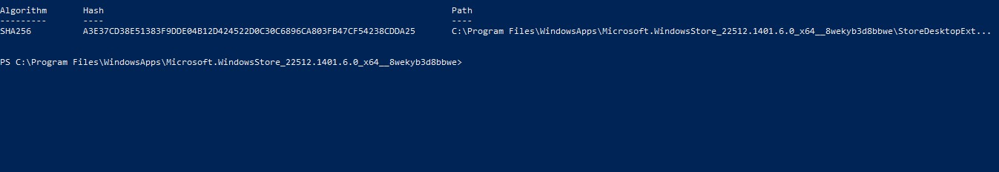

## 1. Example

Existe uma corporação cujos hosts estão operando com o antivírus [**PaloAlto Cortex XDR**](https://www.paloaltonetworks.com/cortex/cortex-xdr) instalado em cada um dessas máquinas, independentemente de onde elas se localizam de modo físico no escritório.

As máquinas estão atuando com Windows 10 Pro versão 22H2.

Seguindo este cenário de exemplo, o software apresenta um alerta, um pop-up que surge de maneira repentina para um de nossos colaboradores.

O alerta mais recente, ocorrido às `10:28:09` do dia `26 de janeiro de 20226`, é o seguinte:



## 2. Detalhamento do Alerta

Segundo os detalhes do evento presentes no próprio alerta, é possível localizar algumas informações:

```text
    Source process ID: 10264
    Source process name: StoreDesktopExtension.exe
    Source application location: C:\Program Files\WindowsApps\
```

## 3. Source Location 

O diretório informado logo acima está dedicado para **manter os aplicativos provenientes da Microsoft Store e system UWP applications**.

UWP (Universal Windows Platform) é um método de permitir que todos os aplicativos para Windows mantenham-se integrados, utilizando-se de `APIs Win32` e `classes .NET`, além de declarar quais recursos do dispositivos e quais dados serão acessados com a autorização do usuário.

O diretório já citado está por padrão oculto e protegido pelo `TrustInstaller` para prevenir qualquer tipo de modificação não autorizada.

É possível permitir a habilitação de `Hidden items` no próprio Windows Explorer.


**Font:** Bitdefender

No entanto, dependendo de como foi definido a configuração de segurança do atual usuário da máquina, **será necessário a senha de usuário para permitir o acesso à pasta**.

> It can grow very large due to multiple versions of apps being stored, or it might hold onto data from deleted apps.

> Tampering with, deleting, or renaming files in this folder can cause severe issues with installed apps and system stability.

## 4. PowerShell

Outro método é o acesso à pasta em questão por meio do PowerShell no modo de administrador, sem a necessidade de causar dados diretos às aplicações devido ao trabalho de análise técnica que está sendo desenvolvido neste exemplo.



O exemplo acima mostra os arquivos presentes no diretório WindowsApps, o que possibilita a localização exata do executável que deverá ser analisado.

## 5. Hashing

O próximo passo é a utilização de um algoritmo criptográfico - neste caso sendo o `SHA-256` - para gerantir uma assinatura digital única em nosso arquivo suspeio para garantir sua integridade no último passo de nossa análise.

É possível que esse método seja executado pelo Command Prompt através do `certutil`. 

Também existem ferramentas de terceiros, como é o caso da HashMyFiles (NirSoft) ou HashTool (Microsoft), no caso de não houver muita experiência no uso do Shell do sistema operacional Windows.

Porém, como já conseguimos acessar o diretório, iremos permanecer no PoweShell para então utilizarmos o utilitário `Get-FileHash`. 

No terminal, insira o seguinte comando:

```bash
Get-FileHash -Path StoreDesktopExtension.exe
```



A hash acima é o que estamos necessidando para nossa análise mais eficiente.

## 6. Total Virus

### 6.1. Overview

De acordo com a própria plataforma.